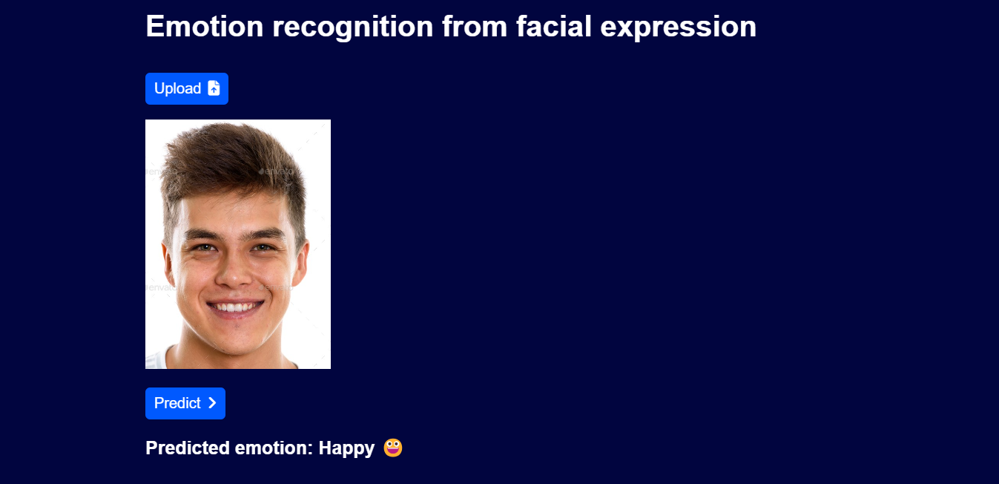

# Facial Emotion recognition

### Overview
This GitHub repository contains code for an image classification project aimed at recognizing emotions from facial expressions. The project utilizes machine learning techniques to classify emotions into seven categories: angry, disgusted, fearful, happy, neutral, sad, and surprised.



### Dataset
The model was trained on a dataset consisting of 48x48 grayscale images, each labeled with one of the seven emotion categories.

[Link for dataset](https://www.kaggle.com/datasets/ananthu017/emotion-detection-fer/data)

### Model Architecture
Two approaches were employed for model training:
- Custom Conv2D: A custom convolutional neural network architecture designed specifically for this task.
- Transfer Learning with EfficientNetV2B2: Transfer learning using the EfficientNetV2B2 architecture pretrained on ImageNet.

### Model Evaluation
The model's performance was evaluated using accuracy metrics. The custom Conv2D approach achieved an accuracy of approximately 58%, while transfer learning with EfficientNetV2B2 achieved around 66%.

### Flask App
A Flask web application was developed to showcase the emotion recognition functionality. The app utilizes the saved Conv2D model for real-time emotion classification from user-provided images.

### Usage guide
1. Clone the repository to your local machine.
```bash
git clone https://github.com/Mainakcris7/facial_emotion_recognition.git
```
2. Install the required dependencies
```bash
pip install -r requirements.txt
```
3. Run the Flask app 
```bash 
python app.py
```

### Considerations
Despite achieving decent accuracy, there is room for improvement in the model's performance. Future iterations may focus on fine-tuning hyperparameters, exploring different architectures, or expanding the dataset to improve accuracy.

### Contributor
For any further queries, please contact via Email at [mainakcr72002@gmail.com](mainakcr72002@gmail.com)
